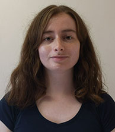

## Research Group Leader

{:class="img-responsive"} 
[Michael Bliss Singer]()

## DOWN2EARTH Project Manager

{:class="img-responsive"} 
[Toby Pitts](), Funding: [EU Horizon 2020 Project DOWN2EARTH](https://cordis.europa.eu/project/id/869550) 
[School of Earth and Environmental Sciences](https://www.cardiff.ac.uk/earth-environmental-sciences) [Cardiff University](https://www.cardiff.ac.uk/) 

## Current Postdocs
#### (Singer's role in parentheses)

 
{:class="img-responsive"} 
[Andrés Quichimbo](), Postdoctoral Researcher (Advisor), Funding: [EU Horizon 2020 Project DOWN2EARTH](https://cordis.europa.eu/project/id/869550) 
[School of Earth and Environmental Sciences](https://www.cardiff.ac.uk/earth-environmental-sciences) [Cardiff University](https://www.cardiff.ac.uk/) 

{:class="img-responsive"} 
[Manuel Rios Gaona](), Postdoctoral Researcher (Advisor), Funding: [EU Horizon 2020 Project DOWN2EARTH](https://cordis.europa.eu/project/id/869550) 
[School of Earth and Environmental Sciences](https://www.cardiff.ac.uk/earth-environmental-sciences) [Cardiff University](https://www.cardiff.ac.uk/) 

{:class="img-responsive"} 
[Dagmawi Asfaw](), Postdoctoral Researcher (Co-Advisor), Funding: [The Royal Society](https://royalsociety.org/grants-schemes-awards/grants/challenge-led-grants/) 
[School of Geographical Sciences](http://www.bristol.ac.uk/geography/) [University of Bristol](https://www.bristol.ac.uk/) 

{:class="img-responsive"} 
[Jacob Rigby](), Postdoctoral Researcher (Co-Advisor), Funding: [Global Challenges Research Fund](https://www.ukri.org/research/global-challenges-research-fund/) 
[School of Geographical Sciences](http://www.bristol.ac.uk/geography/) [University of Bristol](https://www.bristol.ac.uk/) 

## Current PhD Students 
#### (Singer's role in parentheses)

 
{:class="img-responsive"} 
[George Blake](), PhD (Co-Advisor), Funding: [NERC GW4 Doctoral Training Programme](https://www.nercgw4plus.ac.uk/) 
[School of Geographical Sciences](http://www.bristol.ac.uk/geography/), [University of Bristol](http://www.bristol.ac.uk). 
**Thesis: Assessing climate forcing of the water cycle in the Horn of Africa Drylands** (_2022-_)

{:class="img-responsive"} 
[Katherine Cocking](), PhD (Primary Advisor), Funding: College of Physical Sciences and Engineering, Cardiff University 
[School of Earth & Environmental Sciences](https://www.cardiff.ac.uk/earth-environmental-sciences), [Cardiff University](https://www.cardiff.ac.uk) 
**Thesis: Climate change projections and impacts in the Horn of Africa Drylands** (_2021-_)

{:class="img-responsive"} 
[Pierre Lochin](), PhD (Co-Advisor), Funding: [H2O'Lyon](https://h2olyon.universite-lyon.fr/h2o-90225.kjsp) 
[Université de Lyon](https://www.universite-lyon.fr/version-anglaise/). 
**Thesis: Controls on riparian forest water availability and corresponding vegetation responses** (_2021-_)

{:class="img-responsive"} 
[Saskia Salwey](), PhD (Co-Advisor), Funding: [NERC GW4 Doctoral Training Programme](https://www.nercgw4plus.ac.uk/) 
[School of Geographical Sciences](http://www.bristol.ac.uk/geography/), [University of Bristol](http://www.bristol.ac.uk). 
**Thesis: Modelling reservoir storage at catchment to regional scales** (_2020-_)

{:class="img-responsive"}
 [Conor McMahon](), PhD (Co-Advisor), Funding: [Strategic Environmental Research and Development Program (US Department of Defense)](https://www.serdp-estcp.org/) 
[Department of Geography](https://geog.ucsb.edu/), [UC Santa Barbara](https://www.ucsb.edu/) 
**Thesis: Fractional pixel signature of riparian forest stress in response to water availability** (_2019-_)

{:class="img-responsive"} 
[Bryn Morgan](), PhD (Co-Advisor), Funding: [National Science Foundation Hydrologic Sciences](https://www.nsf.gov/funding/pgm_summ.jsp?pims_id=13684) and [SERDP (DoD)](https://www.serdp-estcp.org/) 
[Department of Geography](https://geog.ucsb.edu/), [UC Santa Barbara](https://www.ucsb.edu/) 
**Thesis: Modeling and measuring climate-controlled water availability in riparian forests** (_2018-2023_)

{:class="img-responsive"} 
[Jared Williams](), PhD (Co-Advisor), Funding: [National Science Foundation Geography & Spatial Sciences](https://www.nsf.gov/funding/pgm_summ.jsp?pims_id=505034) 
[SUNY-ESF](https://www.esf.edu/)  
**Thesis: Water use and plant growth in a multiple-use basin** (_2018-_)

## Current Masters Students

 
## Past Postdoctoral Researchers

{:class="img-responsive"} 
[Li Kui](), Postdoctoral Researcher (Advisor), Funding: [National Science Foundation Geography & Spatial Sciences](https://www.nsf.gov/funding/pgm_summ.jsp?pims_id=505034) and [The Nature Conservancy](https://www.tnc.org) 
[Earth Research Insitute](https://eri.ucsb.edu/), [UC Santa Barbara](https://www.ucsb.edu/) 

{:class="img-responsive"} 
[Farai Kaseke](), Postdoctoral Researcher (Advisor), Funding: [Strategic Environmental Research and Development Program (US Department of Defense)](https://www.serdp-estcp.org/) 
[Earth Research Insitute](https://eri.ucsb.edu/), [UC Santa Barbara](https://www.ucsb.edu/) 

{:class="img-responsive"} 
[Marc Mayes](), Postdoctoral Researcher (Co-Advisor), Funding: [Strategic Environmental Research and Development Program (US Department of Defense)](https://www.serdp-estcp.org/) 
[Earth Research Insitute](https://eri.ucsb.edu/), [UC Santa Barbara](https://www.ucsb.edu/) 

## Past Graduate Students (PhD and Masters)

{:class="img-responsive"} 
[Melissa Rohde](), PhD (Co-Advisor), Funding: [National Science Foundation Geography & Spatial Sciences](https://www.nsf.gov/funding/pgm_summ.jsp?pims_id=505034) 
[SUNY-College of Environmental Science and Foresty](https://www.esf.edu/)  
**Thesis: Development of ecological forest health indices in groundwater dependent ecosystems** (_2018-2023_)

{:class="img-responsive"} 
[Eferhonore Efe-Eyefia ](), PhD (Co-Advisor), Funding: [TETFund](https://tetfundserver.com/) 
[School of Mathematics](https://www.cardiff.ac.uk/mathematics), [Cardiff University](http://www.cardiff.ac.uk). 
**Thesis: Modelling spatial and temporal components of rainfall events** (_2020-2023_)

{:class="img-responsive"} 
[Christopher Kibler](), PhD (Co-Advisor), Funding: [National Science Foundation Geography & Spatial Sciences](https://www.nsf.gov/funding/pgm_summ.jsp?pims_id=505034) 
[Department of Geography](https://geog.ucsb.edu/), [UC Santa Barbara](https://www.ucsb.edu/) 
**Thesis: Remotely sensed signatures of riparian forest stress in response to water availability** (_2018-2023_)

{:class="img-responsive"} 
[Maria Warter](), PhD (Primary Advisor), Funding: [Strategic Environmental Research and Development Program (US Department of Defense)](https://www.serdp-estcp.org/) 
[School of Earth & Environmental Sciences](https://www.cardiff.ac.uk/earth-environmental-sciences), [Cardiff University](https://www.cardiff.ac.uk) 
**Thesis: Quantifying water availability to plants under climate change** (_2018-2022_)

{:class="img-responsive"} 
[Romy Sabathier](), PhD (Primary Advisor), Funding: [Strategic Environmental Research and Development Program (US Department of Defense)](https://www.serdp-estcp.org/) 
[School of Earth & Environmental Sciences](https://www.cardiff.ac.uk/earth-environmental-sciences), [Cardiff University](https://www.cardiff.ac.uk) 
**Thesis: Development and assessment of indicators of forest health in response to climate change** (_2018-2023_)

{:class="img-responsive"} 
[Isaac Kipkemoi](), PhD (Co-Advisor), Funding: Kenyan Government Scholarship 
[School of Geographical Sciences](http://www.bristol.ac.uk/geography/), [University of Bristol](http://www.bristol.ac.uk). 
**Thesis: Detecting signatures of drought in vegetation of East Africa** (_2018-2023_)

{:class="img-responsive"} 
[Lissa Pelletier](), MS (Co-Advisor), Funding: [Strategic Environmental Research and Development Program (US Department of Defense)](https://www.serdp-estcp.org/) 
[SUNY-ESF](https://www.esf.edu/)  
**Thesis: Plant growth and ecosystem health metrics in drought-prone ecosystems** (_2018-2022_)

{:class="img-responsive"} 
[Andrés Quichimbo](), PhD (Co-Advisor), Funnding: Cardiff University 
[School of Earth & Environmental Sciences](https://www.cardiff.ac.uk/earth-ocean-sciences), [Cardiff University](https://www.cardiff.ac.uk) 
**Thesis: Groundwater modelling of climatic controls on recharge** (_2017-2021_)

{:class="img-responsive"} 
[Nooshin Mehrnegar](), PhD (Co-Advisor), Funding: Cardiff University 
[School of Earth & Environmental Sciences](https://www.cardiff.ac.uk/earth-ocean-sciences), [Cardiff University](https://www.cardiff.ac.uk) 
**Thesis: Modelling of global hydrologic fluxes via remote sensing and data assimilation** (_2017-2021_)

{:class="img-responsive"} 
[Thomas Myktyn](), MS (Co-Advisor), [Department of Geology](http://www.sjsu.edu/geology/) 
[San Jose State University](http://www.sjsu.edu/)  
**Thesis: History of deep mercury storage in Yolo Bypass** (_2016-2020_)

{:class="img-responsive"} 
[Shiuan-An Chen](), PhD (Co-Advisor), Self-funded, [School of Geographical Sciences](http://www.bristol.ac.uk/geography/) 
[University of Bristol](http://www.bristol.ac.uk). 
**Thesis: Climatic controls on drainage basin hydrology and topographic evolution** (_2016-2021_)

Rory Hollings, MS (Co-Advisor)  
**Thesis: How do rainstorms shape dryland river basins?** (_2014-2017_)

Cristina Evans, PhD (Primary Advisor), Funding: [NERC Iapetus Doctoral Training Programme](http://www.iapetus.ac.uk/) 
[Department of Earth and Environmental Sciences](https://www.st-andrews.ac.uk/earth-sciences/), [University of St Andrews](http://www.st-andrews.ac.uk) 
**Thesis: Modeling climate, topography, and substrate controls on water partitioning in river floodplains** (_2013-2017_)

[Chris Sargeant](https://www.linkedin.com/in/christopher-sargeant-ph-d-mienvsc-aiema-5069471a3/), PhD (Primary Advisor), Funding: [NERC Iapetus Doctoral Training Programme](http://www.iapetus.ac.uk/) 
[Department of Earth and Environmental Sciences](https://www.st-andrews.ac.uk/earth-sciences/), [University of St Andrews](http://www.st-andrews.ac.uk) 
**Thesis: The ecohydrologic signature of drought in river corridors** (_2013-2017_)

[Tyler Nakamura](https://www.linkedin.com/in/tyler-nakamura-11a11254), MS (Co-Advisor) 
[Department of Geology](http://www.sjsu.edu/geology/), [San Jose State University](http://www.sjsu.edu/)  
**Thesis: Deep storage of hydraulic mining sediment along the Lower Yuba River, CA** (_2015-2017_)

[Louise Slater](https://www.geog.ox.ac.uk/staff/lslater.html), PhD (Primary Advisor), Funding: [NERC Iapetus Doctoral Training Programme](http://www.iapetus.ac.uk/) 
[Department of Earth and Environmental Sciences](https://www.st-andrews.ac.uk/earth-sciences/), [University of St Andrews](http://www.st-andrews.ac.uk) 
**Thesis: Trends in alluvial channel geometry and streamflow: an investigation of patterns and controls** (_2010-2014_)

[John Higson](https://www.edinburghrowing.co.uk/coaches), MS (Primary Advisor), Funding: [NERC Iapetus Doctoral Training Programme](http://www.iapetus.ac.uk/) 
[Department of Earth and Environmental Sciences](https://www.st-andrews.ac.uk/earth-sciences/), [University of St Andrews](http://www.st-andrews.ac.uk) 
**Thesis: The impact of the streamflow hydrograph on sediment supply from terrace erosion** (_2009-2014_)

[Nina Kilham](https://scholar.google.com/citations?user=0TJJwysAAAAJ&hl=en), PhD (Co-Advisor) 
[Department of Geography](https://geog.ucsb.edu/), [UC Santa Barbara](https://www.ucsb.edu/) 
**Thesis: Floodplain Sedimentation on the Feather River, California: Combined Use of Remote Sensing and Numerical Modeling to Analyze Contemporary Deposition Patterns in a Historically Mined Basin** (_2005-2009_)

[Mike Springborn](https://springborn.faculty.ucdavis.edu/), PhD (Project Leader) 
[Donald Bren School of Environmental Science and Management](https://bren.ucsb.edu/), [UC Santa Barbara](https://www.ucsb.edu/) 
**Project: Sediment-adsorbed total mercury flux through Yolo Bypass, the primary floodway and wetland in the Sacramento Valley, California** (_2006_)

## Recent and Current Collaborators

[Katerina Michaelides](http://www.bristol.ac.uk/geography/people/katerina-michaelides/overview.html), [School of Geographical Sciences](http://www.bristol.ac.uk/geography/), [University of Bristol](http://www.bristol.ac.uk).  

[Kelly Caylor](http://caylor.eri.ucsb.edu/people/caylor/), [Earth Research Institute](https://www.eri.ucsb.edu)[UC Santa Barbara](https://www.ucsb.edu/)  

[John Stella](https://www.esf.edu/faculty/stella/), [SUNY-College of Environmental Science and Foresty](https://www.esf.edu/)  

[Dar Roberts](https://sites.google.com/site/ucsbviperlab/), [Department of Geography](https://geog.ucsb.edu/), [UC Santa Barbara](https://www.ucsb.edu/)  

[Mark Cuthbert](https://www.cardiff.ac.uk/people/view/617129-cuthbert-mark), [School of Earth & Environmental Sciences](https://www.cardiff.ac.uk/earth-environmental-sciences), [Cardiff University](https://www.cardiff.ac.uk) 

[Dan Hobley](https://www.cardiff.ac.uk/people/view/481890-), [School of Earth & Environmental Sciences](https://www.cardiff.ac.uk/earth-environmental-sciences), [Cardiff University](https://www.cardiff.ac.uk) 

[Stuart Grieve](https://www.qmul.ac.uk/geog/staff/grieves.html), [School of Geography](https://www.qmul.ac.uk/geog/), [Queen Mary University](https://www.qmul.ac.uk/) 

[Joel Blum](https://lsa.umich.edu/earth/people/faculty/jdblum.html), [Earth and Environmental Sciences](https://lsa.umich.edu/earth), [University of Michigan](https://www.umich.edu) 

[Owen Jones](https://www.cardiff.ac.uk/people/view/556930-jones-owen), [School of Mathematics](https://www.cardiff.ac.uk/mathematics), [Cardiff University](https://www.cardiff.ac.uk) 

[Manny Gabet](http://www.sjsu.edu/geology/people/faculty/gabet/index.html), [Department of Geology](http://www.sjsu.edu/geology/), [San Jose State University](http://www.sjsu.edu/) 

[James Kirchner](https://usys.ethz.ch/en/people/profile.james-kirchner.html), [Dept. of Environmental Systems Science](http://www.usys.ethz.ch/), [ETH Zurich](https://ethz.ch/en.html) 

[Patrick Donovan](https://www.linkedin.com/in/patrick-donovan-5a804256/), Natural Resources Policy Advisor to [Sen. Michael Bennett](https://www.bennet.senate.gov/) 

[Martin Tsui](https://biology.uncg.edu/people/martin-tsz-ki-tsui/), [Department of Biology](https://biology.uncg.edu/), [University of North Carolina Greensboro](https://uncg.edu/) 

[Lee Harrison](http://scholar.google.com/citations?user=nXkb7n0AAAAJ&hl=en), [NOAA Marine Fisheries](https://swfsc.noaa.gov/) 

[Spencer Washburn](https://scholar.google.com/citations?user=x48vvL8AAAAJ&hl=en), [Smithsonian Environmental Research Center](https://serc.si.edu/) 

[Rafael Rosolem](http://www.bristol.ac.uk/engineering/people/rafael-rosolem/overview.html), [School of Engineering](http://www.bristol.ac.uk/engineering/), [University of Bristol](http://www.bristol.ac.uk). 

[Mark Tebboth](https://people.uea.ac.uk/m_tebboth), [School of International Development](https://www.uea.ac.uk/international-development), [University of East Anglia](http://www.uea.ac.uk). 

[Roger Few](https://people.uea.ac.uk/r_few), [School of International Development](https://www.uea.ac.uk/international-development), [University of East Anglia](http://www.uea.ac.uk). 

[Dann Mitchell](http://www.bristol.ac.uk/geography/people/dann-m-mitchell/overview.html), [School of Geographical Sciences](http://www.bristol.ac.uk/geography/), [University of Bristol](http://www.bristol.ac.uk).  

[Ehsan Forootan](https://www.uni-hohenheim.de/en/organization/person/dr-ing-ehsan-forootan), [Institute of Physics and Astronomy](https://www.uni-hohenheim.de/en/organization/institution/institut-fuer-physik-und-meteorologie), [University of Hohenheim](https://www.uni-hohenheim.de).  

[Dan Shien](http://www.bristol.ac.uk/engineering/people/daniel-schien/), [School of Engineering](http://www.bristol.ac.uk/engineering/), [University of Bristol](http://www.bristol.ac.uk).  

[Chris Preist](http://www.bris.ac.uk/engineering/people/chris-w-preist/index.html), [School of Engineering](http://www.bristol.ac.uk/engineering/), [University of Bristol](http://www.bristol.ac.uk).  

[Oliver Wasonga](http://www.oliverwasonga.info), [Department of Land Resource Management and Agricultural Technology](https://larmat.uonbi.ac.ke/), [University of Nairobi](https://www.uonbi.ac.ke/).  

[Mohammed Assen](http://www.aau.edu.et/idpr/mohammed-assen/), [Institute of Development and Policy Research](http://www.aau.edu.et/idpr), [Addis Ababa University](http://www.aau.edu.et/).  

[Flavian Muthusi](https://www.researchgate.net/profile/Flavian_Muthusi), [FAO Somalia Water and Land Information Management (SWALIM)](http://www.faoswalim.org/)  

[Peris Muchiri](https://ke.linkedin.com/in/peris-muchiri-592426170), [FAO Somalia Water and Land Information Management (SWALIM)](http://www.faoswalim.org/)  

## We invite you to visit the websites of our close collaborators:

[Dryland Research Group](http://michaelides.eri.ucsb.edu/)

[WAVES Lab](http://caylor.eri.ucsb.edu/)

[VIPER Lab](http://geog.ucsb.edu/viper/)

[Stella Lab](https://www.esf.edu/fnrm/stella/)